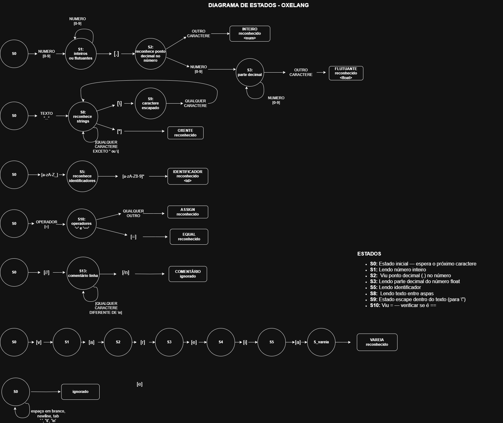

# Oxe Lang - Analisador Léxico  

## MATA61 - Compiladores

**Autores:**  

- Isaac Araujo  
- Otávio Cartaxo  
- Rísia Cerqueira

---

## Sobre a Oxe Lang (`.bais`)

**Oxe Lang** é uma linguagem de programação didática inspirada na cultura baiana, criada para o projeto de **Análise Léxica** da disciplina de **Compiladores**. Sua sintaxe mistura elementos de linguagens estruturadas com tokens e palavras-chave que remetem ao vocabulário e expressões típicas da Bahia.

O analisador léxico desenvolvido reconhece e classifica tokens específicos da Oxe Lang, facilitando o entendimento do processo de análise léxica.

---

## 📁 Estrutura dos Arquivos `.bais`

Arquivos `.bais` contêm código-fonte em Oxe Lang. O analisador identifica:

- ✅ Tipos de dados  
- ✅ Palavras-chave culturais  
- ✅ Operadores  
- ✅ Identificadores  
- ✅ Funções  
- ✅ Comentários  

---

## Tipos de Dados

| Tipo        | Descrição                         | Exemplo                                 |
| ----------- | --------------------------------- | --------------------------------------- |
| `inteiro`   | Números inteiros                  | `var inteiro idade = 21;`               |
| `flutuante` | Números com casas decimais        | `const flutuante pi = 3.1415;`          |
| `oxe`       | Caractere único                   | `const oxe letra = 'B';`                |
| `oxente`    | Cadeia de caracteres (strings)    | `var oxente frase = "É nóis na fita!";` |
| `nada`      | Tipo sem retorno (funções "void") | `barril minhaFuncao(): nada { ... }`    |

---

## Palavras-chave e Tokens Culturais

| Palavra-chave    | Uso                           |
| ---------------- | ----------------------------- |
| `var`, `const`   | Declaração de variáveis       |
| `vareia`         | Atribuição com tipo           |
| `barril`         | Definição de função           |
| `se plante`      | Início de condição (if)       |
| `sePlante`       | Condição intermediária (elif) |
| `va nessa`       | Condição final (else)         |
| `paletada`       | Laço de repetição (for)       |
| `enquanto`       | Laço de repetição (while)     |
| `faz...enquanto` | Laço do-while                 |
| `sePique`        | Retorno de valor              |
| `pegaVisao`      | Impressão na tela             |

---

## Operadores

- **Aritméticos:** `+`, `-`, `*`, `/`, `%`, `**`
- **Relacionais:** `==`, `!=`, `<`, `>`, `<=`, `>=`
- **Lógicos:** `&&`, `||`, `!`
- **Bitwise:** `&`, `|`, `^`, `~`
- **Atribuições compostas:** `+=`, `-=`, `*=`, `/=`, `%=`, etc.

**Exemplo:**

```bais
notasAlunos[1] = (nota1 + nota2) / 2.0;
var inteiro resto = numero % 10;
```

---

## Comentários

| Tipo  | Sintaxe                      |
| ----- | ---------------------------- |
| Linha | `// Isso aqui é massa, viu?` |
| Bloco | `/* Comentário arretado */`  |

---

## Estruturas de Controle

### Condicional

```bais
se plante (idade >= 18) {
    pegaVisao("Você é maior de idade.");
} sePlante (idade > 12) {
    pegaVisao("Você é adolescente.");
} va nessa {
    pegaVisao("Você é criança.");
}
```

### Laço `paletada` (for)

```bais
paletada (var inteiro i = 0; i < 5; i++) {
    pegaVisao("Número: " + i);
}
```

### Laço `enquanto` (while)

```bais
var inteiro tentativas = 0;
enquanto (tentativas < 3) {
    pegaVisao("Tentativa número: " + tentativas);
    tentativas++;
}
```

### Laço `faz...enquanto` (do-while)

```bais
vareia inteiro j = 0;
faz {
    pegaVisao("Executando pelo menos uma vez.");
    j++;
} enquanto (j < 1);
```

---

## Funções

### Função com retorno

```bais
barril soma(a: inteiro, b: inteiro): inteiro {
    sePique a + b;
}
```

### Função sem retorno

```bais
barril cumprimenta(): nada {
    pegaVisao("E aí, beleza?");
}
```

### Chamadas de função

```bais
var inteiro resultado = soma(5, 7);
pegaVisao("Resultado: " + resultado);
```

---

## 📄 Exemplo de Código `soma.bais` 

```bais
barril soma(): nada {
    // Declaração e inicialização de variáveis inteiras
    var inteiro a = 10, b = 4;

    // Operação de divisão inteira armazenada em um flutuante
    var flutuante c = a / b;

    // Impressão do resultado
    pegaVisao(c);
}
```

---


## Tabela de Símbolos

Durante o processo de análise léxica, a **Oxe Lang** utiliza uma **Tabela de Símbolos** para armazenar e rastrear todos os identificadores encontrados no código fonte.

Essa tabela é essencial para garantir que variáveis, funções e outros símbolos sejam reconhecidos corretamente ao longo da análise e fases posteriores da compilação.

### Como funciona?

A Tabela de Símbolos é implementada como uma estrutura simples baseada em arrays. Cada identificador único é armazenado na tabela à medida que aparece no código. Quando o mesmo identificador reaparece, sua posição é reutilizada — evitando duplicação.

### Estrutura:

```c
#define MAX_SYMBOLS 100000
#define MAX_ID_LENGTH 256

char symbol_table[MAX_SYMBOLS][MAX_ID_LENGTH];
int symbol_count = 0;
```

- `MAX_SYMBOLS`: Número máximo de símbolos que a tabela pode armazenar.
- `MAX_ID_LENGTH`: Tamanho máximo de cada identificador.
- `symbol_table`: Array que guarda os nomes dos identificadores.
- `symbol_count`: Quantidade atual de símbolos armazenados.

### Função Principal: `get_symbol_position`

```c
int get_symbol_position(const char* id);
```

Essa função é responsável por:

- **Buscar** um identificador já existente na tabela.
- **Adicionar** um novo identificador se ele ainda não estiver registrado.
- **Retornar** a posição do identificador na tabela.
- **Retornar -1** caso a tabela esteja cheia.

Exemplo de uso dentro do analisador:

```c
void print_identifier(const char* yytext_val) {
    printf("ID");
    int pos = get_symbol_position(yytext_val);
    if (pos != -1){
        printf(", %d", pos);
    }
}
```

Essa impressão ajuda a visualizar não apenas que o token é um identificador, mas **qual a sua posição na tabela de símbolos**, facilitando o rastreamento e testes.

------

## ⚙️ Como Executar o Analisador Léxico

1. **Compile o projeto:**

```bash
make
```

2. **Execute o analisador com um arquivo `.bais`:**

```bash
./lexer exemplos/soma.bais
```

A saída será uma lista dos **tokens reconhecidos**, com sua **categoria** e valor identificado.

---

## 📌 Observações Finais

- O projeto foi desenvolvido com **Flex (Lex)**.
- Os padrões léxicos estão definidos no arquivo `oxelang_lexer.l`.
- A linguagem é uma ferramenta **educacional**, com o objetivo de tornar o estudo de análise léxica mais leve, divertido e regionalizado.

---

## Diagrama de Transições

